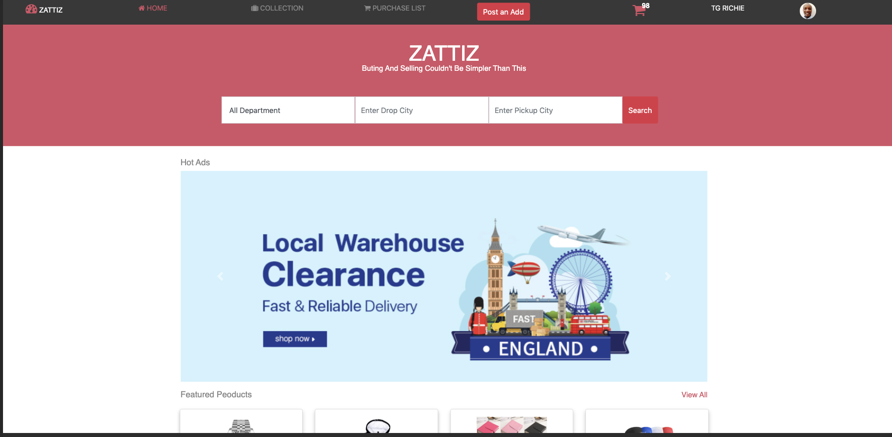
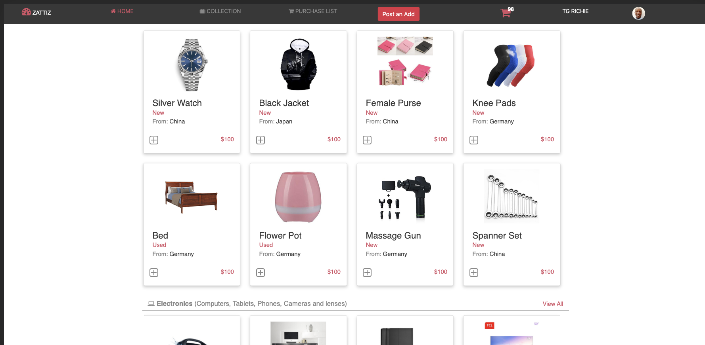
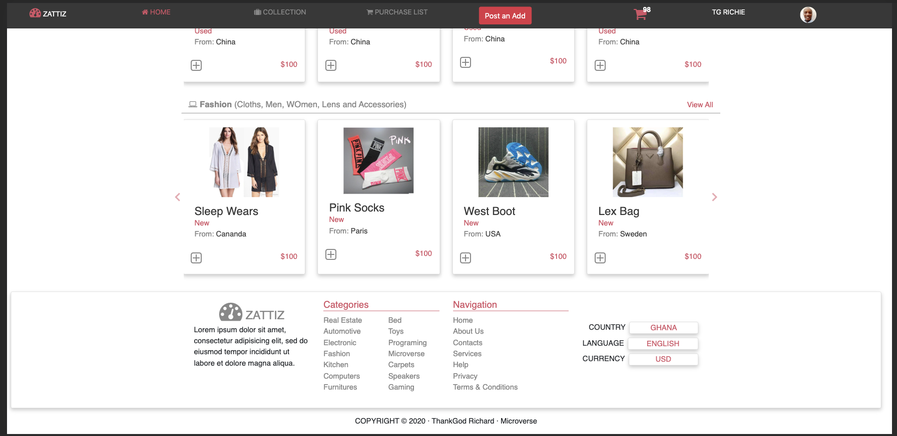
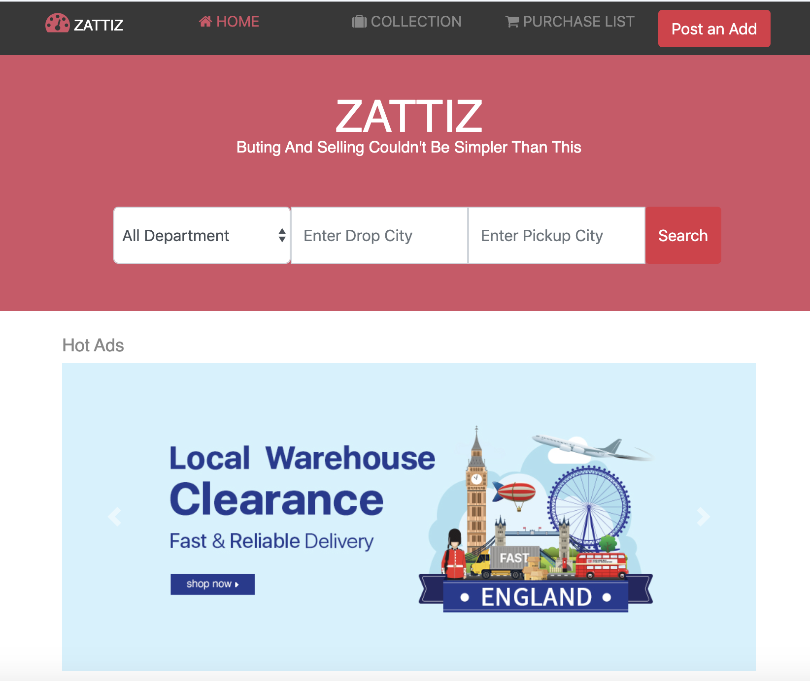
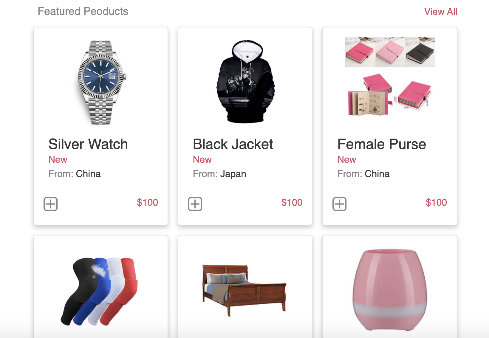
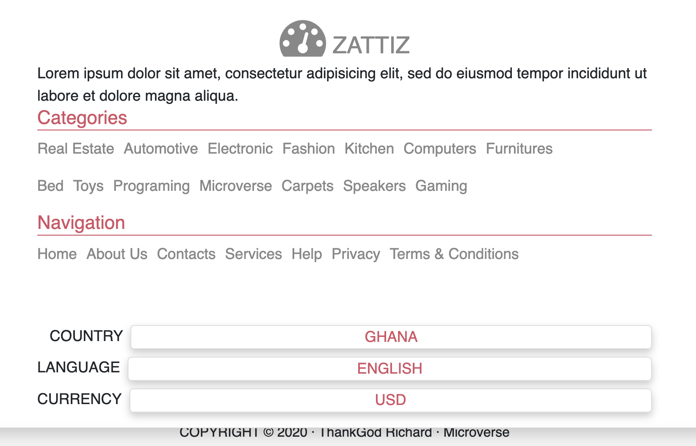
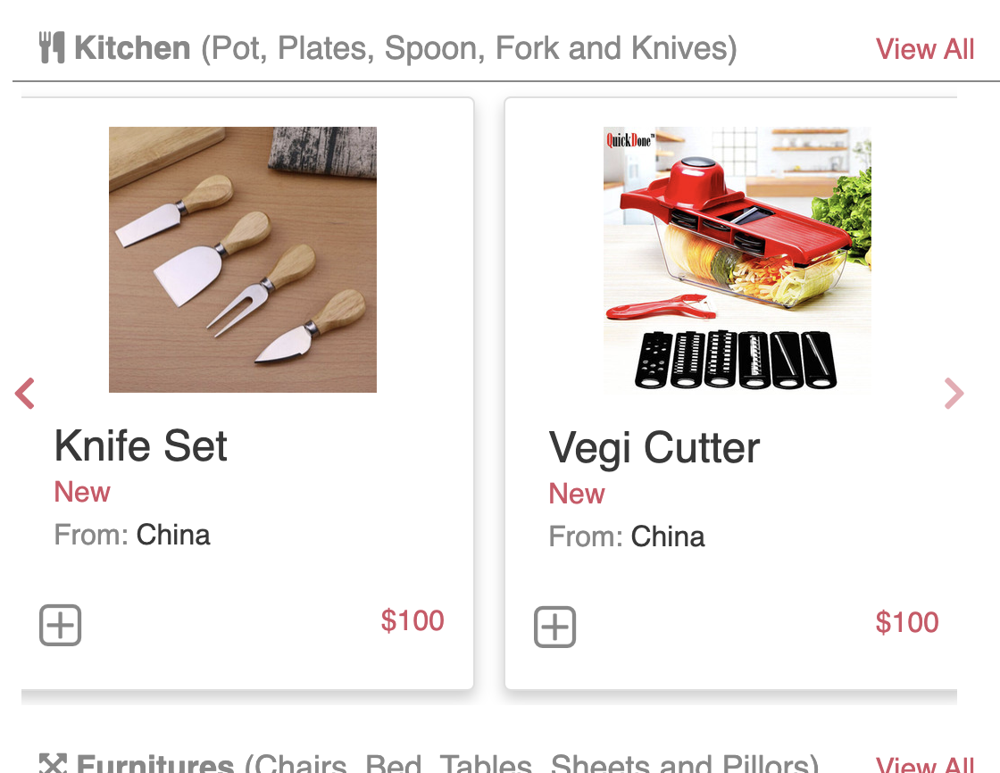
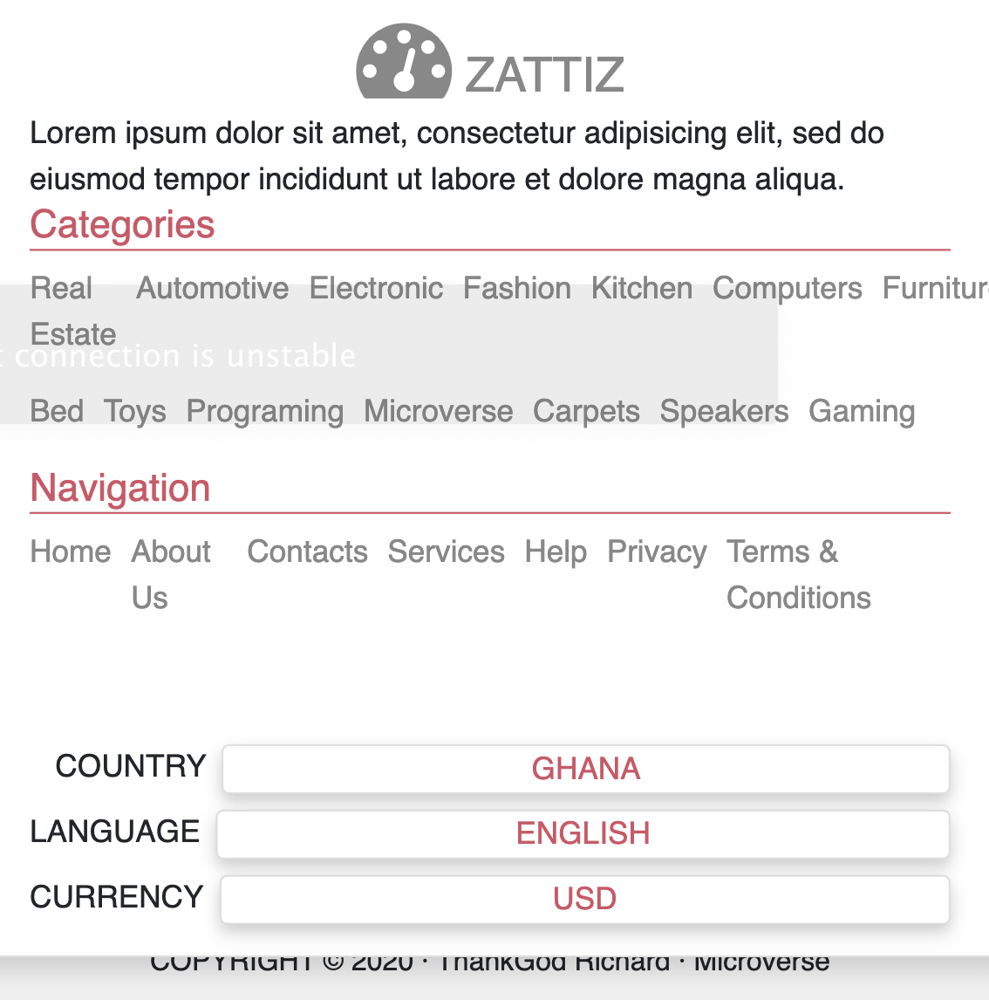

# StoreFront
HTML Design for a Store front using HTML and CSS, i accomplished the use of HTML, CSS and css framwork bootstrap to create responsive website. Using Flexbox for Grid and also media querry to make website more reponsive. 

## Built With

- HTML,
- CSS,

## Large screen Screenshots
 |  | 

## Medium screen Screenshots

## Small screen Screenshots

## Authors

👤 **ThankGod Richard**

- Github: [@githubhandle](https://github.com/thankgodr)
- Twitter: [@twitterhandle](https://twitter.com/thankgodrichard)
- Linkedin: [linkedin](https://linkedin.com/in/thankgodr)

## Live Demo Link

- [Live Demo Url](https://raw.githack.com/thankgodr/StoreFront/feature-dev/index.html)

## 🤝 Contributing

Contributions, issues and feature requests are welcome!

Feel free to check the [issues page](issues/).

## Show your support

Give a ⭐️ if you like this project!

## Acknowledgments

👤 **Mohammed Awad**

Thanks to Mohammed Awad for the design of these project
- Design Link [Click here](https://www.behance.net/gallery/24796463/ZATTIX)

## 📝 License

This project is [MIT](lic.url) licensed.
